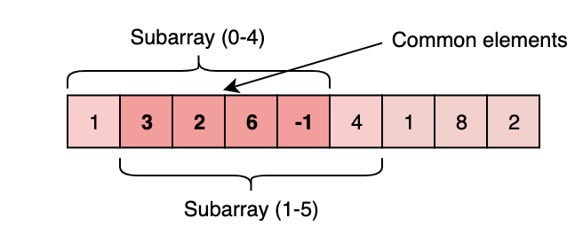

1. **windowStart and windowEnd are indexes.**
2. **Array generally is reduced to n-k+1 elements for a k length window size.**
3. **windowSum/windowAverage/windowMultip can be taken with it.**


BASIS FOR WINDOW SHRINK THAT IS MOVE WINDOWSTART/SHRINK
    if (windowEnd >= k - 1)  //windowOfSizeK
    while (windowSum >= S)  //windowSumLimit
    while (charFrequencyMap.size() > k)  //kDistinctCharacters so rely on Map for distinct
    while (fruitFrequencyMap.size() > 2) //2DistinctCharacters so rely on Map for distinct
    if (charIndexMap.containsKey(rightChar)) // UNIQUE DISTINCT SUBSTRING
    if (windowEnd - windowStart + 1 - maxRepeatLetterCount > k) //Longest SUBSTRING WITH SAME LETTERS AFTER REPLACEMENT
    if (windowEnd - windowStart + 1 - maxOnesCount > k) //Longest Subarray with Ones after Replacement
    if (windowEnd >= pattern.length() - 1) //pattern matching for anagram/permutation of string


**IDENTIFY WHEN:** <br/>
**FINDING/CALCULATE SOMETHING** among all the **contiguous** subarrays/sublists of a **given size**.

#### Example : Given an array, find the average of all contiguous subarrays of size ‘K’ in it.
Input: Arr=[1, 3, 2, 6, -1, 4, 1, 8, 2], K=5<br/>
Output: [2.2, 2.8, 2.4, 3.6, 2.8]<br/>

Explanation:<br/>
(1+3+2+6−1)/5=>2.2 index 0-4<br/>
(3+2+6−1+4)/5=>2.8 index 1-4<br/>
(2+6−1+4+1)/5=>2.4 index 2-6<br/>
...<br/>
#####  Solution 1: Brute-Force
#####  Time: O(N*K)  ‘N’ is the number of elements in the input array; ‘K’ elements
```
import java.util.*;
public class AverageKSizeSubContArray{

     public static void main(String []args){                    // K, Arr
        double[] result = AverageKSizeSubContArray.findAverages(5, new int[] { 1, 3, 2, 6, -1, 4, 1, 8, 2 });
        System.out.println(Arrays.toString(result));
     }
     
     
     public static double[] findAverages(int K, int[] arr) {
        double[] result = new double[arr.length - K + 1];
        for (int i = 0; i <= arr.length - K; i++) {
            int sum = 0;
            for (int j = i; j<(i+K); j++) {
                sum+=arr[j]; // Gets me sum of each set of K elements
            }
            result[i] = sum * 1.0 / K; // Gets me the average of K for each i elements
        }
        return result;
     }
}
```

**Inefficiency**: For any two consecutive subarrays of size ‘5’, overlapping part will be evaluated twice.

**Note**: SubArray index 0-4 and index 1-4 share 4 elements.


#####  Solution 2: Sliding-Window
#####  Time: O(N) Space: O(1)

```
import java.util.*;
public class AverageKSizeSubContArray{

     public static void main(String []args){                    // K, Arr
        double[] result = AverageKSizeSubContArray.findAverages(5, new int[] { 1, 3, 2, 6, -1, 4, 1, 8, 2 });
        System.out.println(Arrays.toString(result));
     }
     
     public static double[] findAverages(int K, int[] arr) {
         /*
        declare resultArray of length arrLength - K + 1 
        maintain windowStart from 0
        maintain windowSum from 0
        iterate overTo windowEnd from 0 to arrLength - 1
            until we reach K; keep on adding to windowSum
                As we reach K; we have our FirstWindow
                    takeAverage and putInResult
                    removeFromSum firstElement (windowStart)
                    update windowStart by 1
        return result
         */

        double[] result = new double[arr.length - K + 1];
        int windowSum = 0;
        int windowStart = 0; // maintainStartOfWindow with this variable
        for (int windowEnd = 0; windowEnd < arr.length; windowEnd++) {
            windowSum += arr[windowEnd]; // Always addToSum nextElement/latestElement

            if (windowEnd >= K - 1) { // if ElementIndex is greater than K itself  we have to remove the element at windowStart
                result[windowStart] = windowSum * 1.0/ K; // willHappen for 1st element after K length is reached
                windowSum -= arr[windowStart]; // subtract the startingElement
                windowStart++; // slide window ahead for next iteration
            }
        }
        return result;
    
    }
}
```
