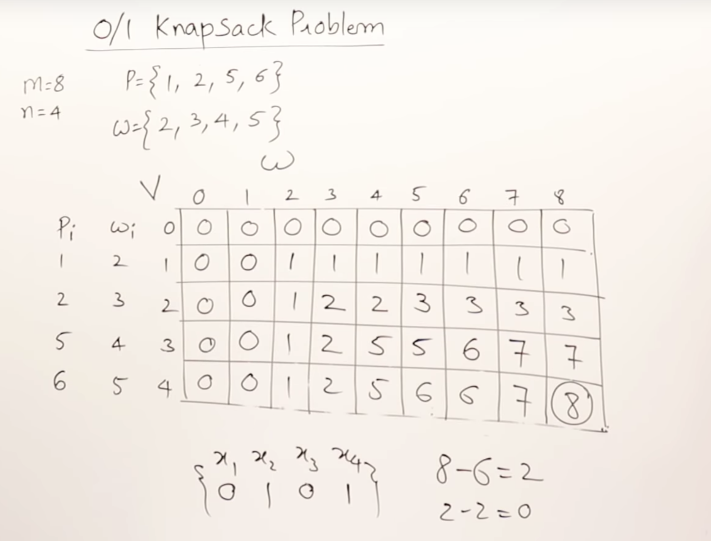

https://www.youtube.com/watch?v=nLmhmB6NzcM

#### Todo: Total Profit Maximized

Profit and Weight

P = {1,2,5,6}

W = {2,3,4,5}

m = 8 (Bag capacity)

n = 4 (Number of Objects)

Result is a set {1,0,0,1} 

O: Object not picked 

1: Object picked

Possible Solutions here would be:
{1,0,0,1} 
{1,0,1,1}
...

2 raised to 4 solutions
O(2^n)

Tabulation method

Fill table with Profit

