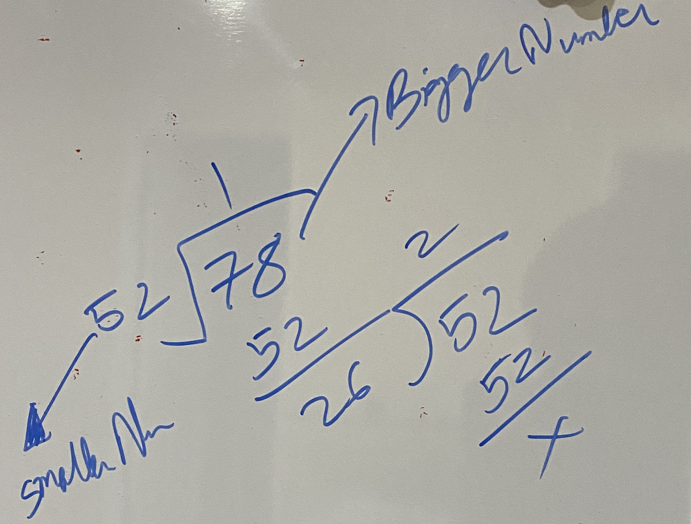

### Decrease and Conquer:
* reduces a problem into a single smaller subproblem..
* reduction can be by a constant value or a constant factor.
* implemented with a **while** loop or **SINGLE** recursion.
  * Binary Search
  * Quickselect
  * Russian Peasant Multiplication
**Note:** Decrease and conquer includes reduction by a constant value (subtract by a value), however we will focus on reduction by a factor (division by a factor).
#### Example : Binary Search
#####  Time: O(logN) Space: O(1)
```
public class BinarySearch{
/*
Input: [1,3,4,5,6,7,8,10,11,13,15,17,20,22], 17
Output: 11
Time: O(log(N)) 

*/
     public static void main(String []args){
        System.out.println(binarySearch(new int[]{1,3,4,5,6,7,8,10,11,13,15,17,20,22}, 17));
    }
    
    
    public static int binarySearch(int[] sortedArray, int target) {
        
        int start = 0; // index: 0
        int end = sortedArray.length - 1;
        
        while (start<=end) {
            int mid = (start + end) / 2;
            // element at center equal than target
            if(sortedArray[mid] == target) { return mid; }
            
            // element at center greater than target: go left
            if(sortedArray[mid] >= target) { end = mid - 1; }
            
            // element at center less than target: go right
            if(sortedArray[mid] <= target) { start = mid + 1; }
        }
        return -1;
    }
}

```

#### Example : Greatest Common Divisor (GCD)
#####  Time: O(logN) Space: O(1)

```
public class GCD{
/*
Greatest Common Divisor (GCD)
Input: 52, 78
Output: 26
52 has prime factors [2, 2, 13]
78 has prime factors [2, 3, 13]

APPLY EUCLID's ALGORITHM THIS IS DECREASE AND CONQUER
Video: https://www.khanacademy.org/computing/computer-science/cryptography/modarithmetic/a/the-euclidean-algorithm

78 - 52 = 26, the GCD must be a factor of 26 as well

WHICH IS: 

GCD(78, 52) = GCD(52, 26) AND/OR GCD(78, 26)

Similarlly

GCD(52, 26) = GCD(52, 26) AND/OR GCD(26, 26)

But GCD(26,26) = 26

*/
     public static void main(String []args){
        System.out.println(getGCD(52, 78));
    }
    
    // number_1 is made sure to be bigger number_2 is made sure to be smaller
    public static int getGCD(int number_1, int number_2) {
        
          // Get absolute values
        if (number_1 < 0) { number_1 *= -1; }
        if (number_2 < 0) { number_2 *= -1; }
        
        // Divide biggerNumber by smallerNumber
            // take remainder and make it the smallerNumber and previous smallerNumber as biggerNumber
        int temp;
        // swap if we get 52, 78 and make it to 78, 52
        if (number_1 < number_2) {
            temp = number_1;
            number_1 = number_2;
            number_2 = temp;
        }
        
        while (number_2 > 0) {
            temp = number_2;
            number_2 = number_1 % number_2;
            number_1 = temp;
        }
        return number_1;
    }
}

```
#### Example : Number of Ones in a Sorted Bit Array
#####  Time: O(logN) Space: O(1)

```
public class OnesInSortedBitArray {
/*
Input: [0,0,0,1,1,1,1,1,1,1,1]
Output: 8
Time: O(log(N))

*/
     public static void main(String []args){
        System.out.println(OnesInArray(new int[]{0,0,0,1,1,1,1,1,1,1,1}, 0, 10));
    }
    
    public static int OnesInArray(int[] sortedBitArray, int low, int high) {
        
        
        if (sortedBitArray[high] == 0) return 0; // lastElement is 0 so no 1s
        if (sortedBitArray[low] == 1) return (high - low + 1); // firsElement is 1 so all 1s
        
        int mid = (low + high)/2;
        
        return OnesInArray(sortedBitArray, low, mid) + OnesInArray(sortedBitArray, mid + 1, high);
    }
}

```