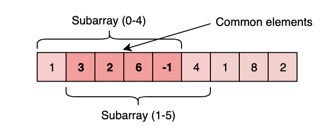

**IDENTIFY WHEN:** <br/>
**FINDING/CALCULATE SOMETHING** among all the **contiguous** subarrays/sublists of a **given size**.

#### Example : Given an array, find the average of all contiguous subarrays of size ‘K’ in it.
Input: Arr=[1, 3, 2, 6, -1, 4, 1, 8, 2], K=5<br/>
Output: [2.2, 2.8, 2.4, 3.6, 2.8]<br/>

Explanation:<br/>
(1+3+2+6−1)/5=>2.2 index 0-4<br/>
(3+2+6−1+4)/5=>2.8 index 1-4<br/>
(2+6−1+4+1)/5=>2.4 index 2-6<br/>
...<br/>
#####  Solution 1: Brute-Force
#####  Time: O(N*K)  ‘N’ is the number of elements in the input array; ‘K’ elements
```
import java.util.*;
public class AverageKSizeSubContArray{

     public static void main(String []args){                    // K, Arr
        double[] result = AverageKSizeSubContArray.findAverages(5, new int[] { 1, 3, 2, 6, -1, 4, 1, 8, 2 });
        System.out.println(Arrays.toString(result));
     }
     
     
     public static double[] findAverages(int K, int[] arr) {
        double[] result = new double[arr.length - K + 1];
        for (int i = 0; i <= arr.length - K; i++) {
            int sum = 0;
            for (int j = i; j<(i+K); j++) {
                sum+=arr[j]; // Gets me sum of each set of K elements
            }
            result[i] = sum * 1.0 / K; // Gets me the average of K for each i elements
        }
        return result;
     }
}
```

**Inefficiency**: For any two consecutive subarrays of size ‘5’, overlapping part will be evaluated twice.

**Note**: SubArray index 0-4 and index 1-4 share 4 elements.


#####  Solution 2: Sliding-Window
#####  Time: O(N) Space: O(1)