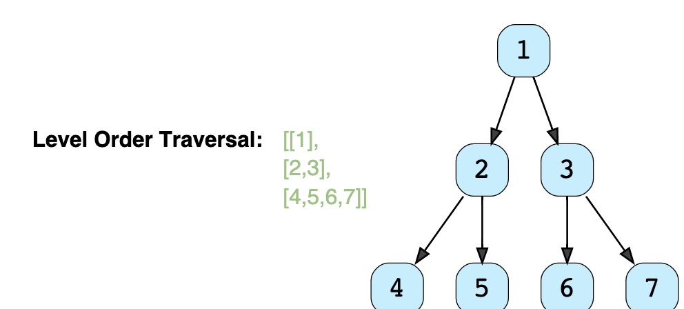
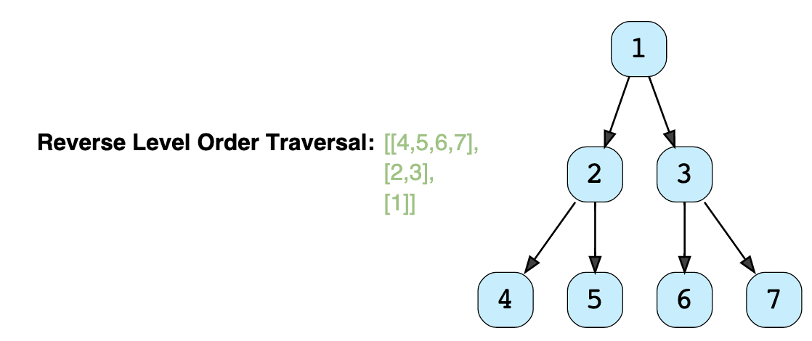

##Breadth First Search (BFS)

* Technique to **traverse a tree**.
    * Traversal of a tree in a **level-by-level order**.
* **Queue** Data Structure is used to keep track of all the nodes of a level. (Before moving to next level)
    * Space complexity of the algorithm will be O(W), where ‘W’ is the maximum number of nodes on any level.

#### Example : Given a binary tree, populate an array to represent its level-by-level traversal. You should populate the values of all nodes of each level from left to right in separate sub-arrays.


Binary Tree Level Order Traversal: 



Reverse Level Order Traversal: 



#####  Solution:
```
/*

For Normal Traversal:
We use ArrayList
List<List<Integer>> result = new ArrayList<List<Integer>>(); // INSERTION AT THE END FOR EACH LEVEL
In the case of ArrayList, appending an element at the beginning means shifting all the existing elements.
result.add(currentLevel);

For Reverse Traversal
We use LinkedList
List<List<Integer>> result = new LinkedList<List<Integer>>(); // INSERTION AT THE BEGINNING FOR EACH LEVEL
result.add(0, currentLevel); 
It is needed to append the level array at the beginning of the result list, a LinkedList will be better, as this shifting of elements is not required in a LinkedList.

N: # of Nodes
Time Complexity O(N)
Space Complexity O(N)
*/
import java.util.*;

class TreeNode {
  int val;
  TreeNode left;
  TreeNode right;

  TreeNode(int x) {
    val = x;
    left = null;
    right = null;
  }
};

public class LevelOrderTraversal {

    public static List<List<Integer>> traverseReverse(TreeNode root) {
        List<List<Integer>> result = new LinkedList<List<Integer>>();
        if (root == null)
        return result;

        Queue<TreeNode> queue = new LinkedList<>();
        queue.offer(root);
        while (!queue.isEmpty()) {
        int levelSize = queue.size();
        List<Integer> currentLevel = new ArrayList<>(levelSize);
        for (int i = 0; i < levelSize; i++) {
            TreeNode currentNode = queue.poll();
            // add the node to the current level
            currentLevel.add(currentNode.val);
            // insert the children of current node to the queue
            if (currentNode.left != null)
            queue.offer(currentNode.left);
            if (currentNode.right != null)
            queue.offer(currentNode.right);
        }
        // append the current level at the beginning
        result.add(0, currentLevel);
        }

        return result;
    }
  public static List<List<Integer>> traverse(TreeNode root) {
    
    // LEVEL ORDER TRAVERSAL would output List of List Val of Nodes
    List<List<Integer>> result = new ArrayList<List<Integer>>();
    
    // If Node is null return result
    if (root == null)
      return result;
      
    // Use a Queue of Type TreeNode for eachLevel
    Queue<TreeNode> queue = new LinkedList<>();
    queue.offer(root); // Since root isnt null push it in
    // java.util.LinkedList.offer(E e) method adds the specified element as the tail (last element) of this list.
    
    // until queue isnt empty for eachValue in Queue
    while (!queue.isEmpty()) {
      int levelSize = queue.size();
      List<Integer> currentLevel = new ArrayList<>(levelSize);
      for (int i = 0; i < levelSize; i++) {
        TreeNode currentNode = queue.poll(); // java.util.LinkedList.poll() method retrieves and removes the head (first element) of this list
        // add the node to the current level
        currentLevel.add(currentNode.val);
        // insert the children of current node in the queue
        if (currentNode.left != null)
          queue.offer(currentNode.left);
        if (currentNode.right != null)
          queue.offer(currentNode.right);
      }
      result.add(currentLevel);
    }

    return result;
  }

  public static void main(String[] args) {
    TreeNode root = new TreeNode(12);
    root.left = new TreeNode(7);
    root.right = new TreeNode(1);
    root.left.left = new TreeNode(9);
    root.right.left = new TreeNode(10);
    root.right.right = new TreeNode(5);
    List<List<Integer>> result = LevelOrderTraversal.traverse(root);
    System.out.println("Level order traversal: " + result);
    result = LevelOrderTraversal.traverseReverse(root);
    System.out.println("Level order traversal reversal: " + result);
  }
}
```
